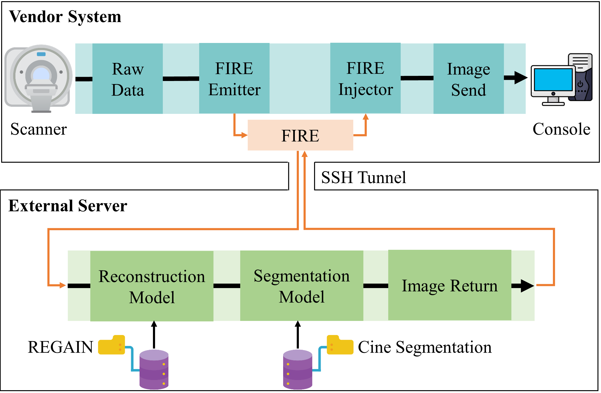

# An Open-source, Flexible, Plug-and-Play Inline CMR Image Segmentation Platform

*This platform facilitates the rapid development and evaluation of any segmentation algorithm in a transparent and reproducible fashion. An open-source, flexible, plug-and-play inline CMR segmentation platform will enable rapid testing and evaluation of new segmentation and analysis algorithms.*

## Contours Produced Using Automatic Segmentation 

## Code

The code in this repository is broken up into two implementations:

- **Segmentation Only:** The code for deploying the segmentation model (CarSON) only is located the `fire_deployment` directory. It contains the model used to segment a SAX cine and the necessary dependencies. It expects to take in fully reconstructed cine images as input.

- **Reconstruction and Segmentation:** The code for deploying the resolution enhancement generative adversarial inline neural network (REGAIN) for accelerated cardiac cine combined with the segmentation model (CarSON) is located in the `regain_carson` directory. It expects to take undersampled k-space data as input.
